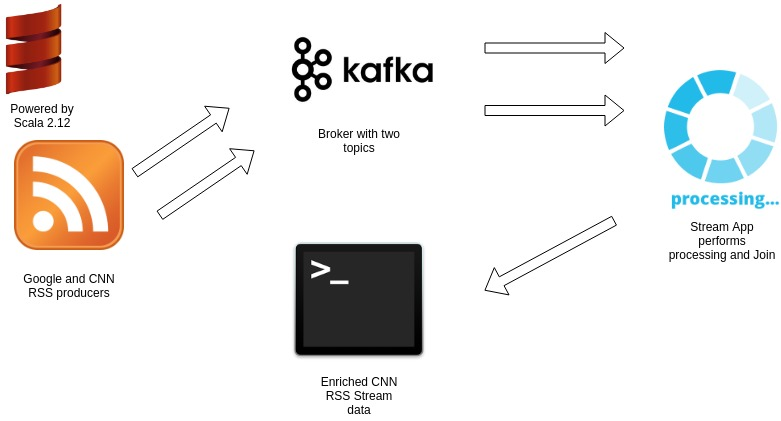

# Scala-rss-kafka

Simple app contains off RSS reader and Kafka producer.
Reads a Google RSS trend news from CNN and writes 
it into Kafka broker. 

- requirements 

Java 8, Scala 2.12, Sbt, Docker, Docker Compose

- steps to launch

`git clone https://github.com/romaanankin/scala-rss.git`

`sbt assembly` 

`docker build -t rss-scala . `

`docker-compose -f docker-compose.yml up`

After launching you can read a reliable news from 
Google trends either from terminal or connecting to a specified 
Kafka topic using console consumer:

install first: 

https://kafka.apache.org/quickstart

then:

`./kafka-console-consumer --bootstrap-server localhost:9092 --topic test --from-beginning`

For testing purposes pooling interval is set to 5000ms. It is easy to get rid 
of duplicates using idempotent consumer.